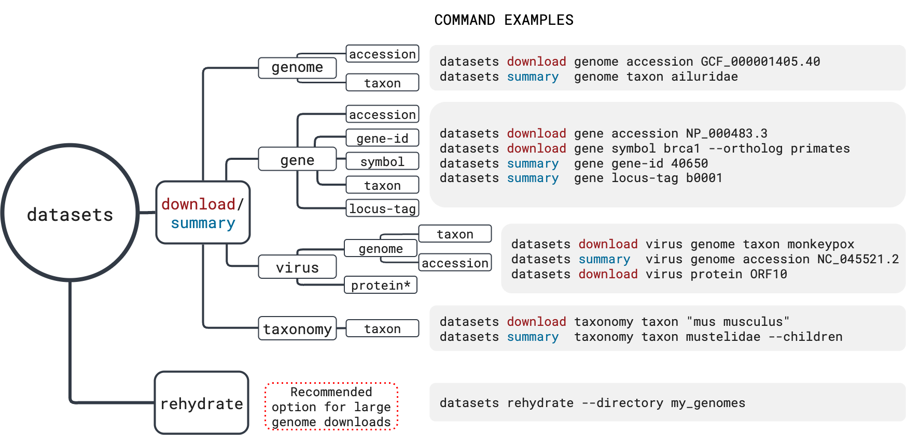
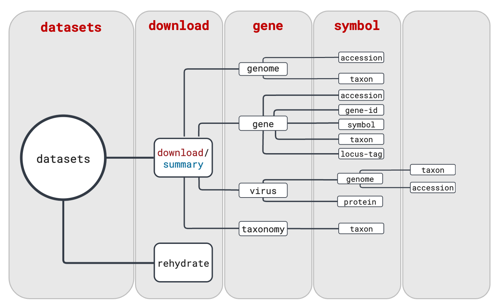
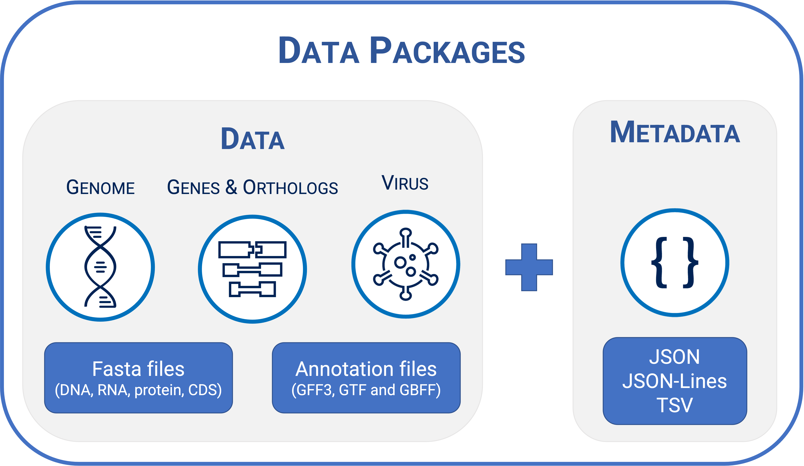

# NIH Research Festival: NCBI Datasets

## Table of Contents<a id="top"></a>

- [Overview of NCBI Datasets](#overview)
   - [Command-line tools: *datasets* and *dataformat*](#cli-tools)
- [Wait... what is a data package?](#data-package)
- [Downloading a gene package](#gene) 
   - [Basic command line examples](#gene-basic)
   - [Downloading a list of genes](#gene-list)
   - [Downloading a set of gene orthologs](#gene-orthologs)
- [Parsing the metadata report](#metadata)


## Overview of NCBI Datasets<a id="overview"></a>


[NCBI Datasets](https://www.ncbi.nlm.nih.gov/datasets/) is a resource that simplifies the discovery, exploration, and downloading of open-access biological sequences and metadata housed at NCBI. NCBI Datasts provides new interfaces for data and metadata access, including [API](https://www.ncbi.nlm.nih.gov/datasets/docs/v2/reference-docs/rest-api/), [web](https://www.ncbi.nlm.nih.gov/datasets/) and [command-line tool](https://www.ncbi.nlm.nih.gov/datasets/docs/v2/download-and-install/). We recently published a paper in the journal [Scientific Data](https://www.nature.com/articles/s41597-024-03571-y) where we provide more information on NCBI Datasets and its guiding principles.

From now on, we will be focusing on the command-line tool, its structure and organization.


### Command-line tools: *datasets* and *dataformat*<a id="cli-tools"></a>

 

While the web interface is helpful, there are times when it's more convenient to access data through a command-line environment. For example, let's say you are working on your institution's high-performance computing (HPC) system and you need to download dozens (or hundreds) of genomes or genes. Even if you're using the Datasets web interface, this would potentially be a two step process: 

1. Download the data package locally;
2. Transfer the files to the HPC system.

With the NCBI Datasets command-line interface (CLI), you can do this process in a single step. Our CLI allows users to access genomes (including viruses), genes and ortholog sets. 

The program follows a hierarchy that makes it easier for users to select exact which options they would like to use. In addition to the program commands, additional flags are available for filtering the results. We will go over those during this tutorial.

The NCBI Datasets CLI command structure is very intuitive. If you take a look at the diagram below, you will notice that the commands are built by choosing one option from each vertical rectangle. 



In addition to *datasets*, we also have *dataformat*, a companion tool to explore and convert metadata to TSV or Excel formats. We will cover the *dataformat* command syntax and use in the metadata section.

&uarr;[top](#top)

### Wait... what is a data package?<a id="data-package"></a>

NCBI Datasets introduced the concept of data packages in order to provide consistent delivery of sequence data and metadata in a single request as a zip archive. Data packages combine data from multiple NCBI databases and can be customized to the user's needs.  



&uarr;[top](#top)

### Downloading a gene package (default) <a id="gene"></a>  
Gene data packages can be retrieved by accession, NCBI Gene ID, gene symbol, locus\_tag or taxon.  Data is available for RefSeq curated gene nucleotide and protein sequences for both Eukaryotes and Prokaryotes. 

The default gene data package includes gene, transcript and protein sequences and one or more data reports. For WP_ accessions, there's no transcript sequence file and there's an additional annotation_report.jsonl (annotated locations of WP proteins on bacterial genomes).


Table 1: Types of nucleotide or protein accession for which data retrieval is available using *datasets* CLI:

| Preffix   |   Molecule type   |   Definition                  |
|-----------|---------------|-------------------------------|
| NM_       |   mRNA        |   Protein-coding transcripts (usually curated) |
| NR_       |   RNA         |   Non-protein-coding transcripts |
| NP_       |   Protein     |   Associated with an NM_ or NC_ accession |
| XM_       |   mRNA        |   Predicted model protein-coding transcript |
| XR_       |   RNA         |   Predicted model non-protein-coding transcript |
| XP_       |   Protein     |   Predicted model, associated with an XM_ accession |
| YP_       |   Protein     |   Annotated on genomic molecules without an instantiated transcript record |
| WP_       |   Protein     |   Non-redundant across multiple strains and species |


&uarr;[top](#top)

#### Basic command line examples <a id="gene-basic"></a>

Let's assume we would like to download a gene data package for the human gene BRCA1. The options below would yield the same results:

- By gene symbol: `datasets download gene symbol brca1`
- By gene ID: `datasets download gene-id 672`
- By accession: `datasets download gene accession NM_007294.4` 

Gene ID, accession and locus tag are unique identifiers, while gene symbol can be shared among multiple taxa. One way of specifying which taxon to retrieve dat from is using the flag `--taxon` in combination with gene symbol. In the example above, we didn't specify the taxon as human because that's the default behavior. 

So, let's say we want to download a data package for the gene BRCA1 for dog. We can use the Gene ID (403437) or invoke the `--taxon` flag under the `symbol` subcommand:


```
datasets download gene symbol brca1 --taxon dog --filename dog-brca1.zip

nzip dog-brca1.zip -d dog-brca1 
Archive:  dog-brca1.zip
  inflating: dog-brca1/README.md      
  inflating: dog-brca1/ncbi_dataset/data/rna.fna  
  inflating: dog-brca1/ncbi_dataset/data/protein.faa  
  inflating: dog-brca1/ncbi_dataset/data/data_report.jsonl  
  inflating: dog-brca1/ncbi_dataset/data/dataset_catalog.json  
  inflating: dog-brca1/md5sum.txt 
  
```

One current limitation about the taxon options under gene in the command line is that it only accepts taxonomic entries at and below species level. For above level queries, you can use our web interface or the API. 

&uarr;[top](#top)

#### Downloading a list of genes <a id="gene-list"></a>

Users also have the option to download a list of genes using the `--inputfile` flag. The list must be in text format, with one gene identifier per line. This flag can be used with gene symbol, gene-id, accession and locus\_tag. 

**Example:**


```
cat locus-tag.txt 

MoV-3mpc04sS1_gp1
MoV-3mpc04sL2_gp1
MoV-3mpc04sS1_gp2
MoV-3mpc04sM1_gp1
MoV-3mpc04sM2_gp1
MoV-3mpc04sS2_gp1
MoV-3mpc04sM3_gp1
MoV-3mpc04sL1_gp1
MoV-3mpc04sL3_gp1
MoV-3mpc04sS3_gp1
MoV-3mpc04sS4_gp1
```
This list can be used as an input both in the new Gene webpage or the CLI.

```
datasets download gene locus-tag --inputfile locus-tag.txt
Collecting 11 gene records [================================================] 100% 11/11
Downloading: ncbi_dataset.zip    7.88kB valid data package
Validating package files [================================================] 100% 5/5


unzip ncbi_dataset.zip -d locus-tag-list
Archive:  ncbi_dataset.zip
  inflating: locus-tag-list/README.md  
  inflating: locus-tag-list/ncbi_dataset/data/protein.faa  
  inflating: locus-tag-list/ncbi_dataset/data/data_report.jsonl  
  inflating: locus-tag-list/ncbi_dataset/data/dataset_catalog.json  
  inflating: locus-tag-list/md5sum.txt  

```

&uarr;[top](#top)

#### Downloading a set of gene orthologs <a id="gene-orthologs"></a>


If you are interested in orthologs annotated in many species, you can use the ortholog option. Using the same example, you would add the `--ortholog` flag and specify the taxonomy range of interest.

```
datasets download gene symbol brca1 --taxon dog --ortholog vertebrates --filename brca1-vertebrates.zip
Collecting 1 gene record [================================================] 100% 1/1
Collecting 441 gene records [================================================] 100% 441/441

unzip brca1-vertebrates.zip -d brca1-vertebrates
Archive:  brca1-vertebrates.zip
  inflating: brca1-vertebrates/README.md  
  inflating: brca1-vertebrates/ncbi_dataset/data/rna.fna  
  inflating: brca1-vertebrates/ncbi_dataset/data/protein.faa  
  inflating: brca1-vertebrates/ncbi_dataset/data/data_report.jsonl  
  inflating: brca1-vertebrates/ncbi_dataset/data/dataset_catalog.json  
  inflating: brca1-vertebrates/md5sum.txt  
  
```

In any circunstance where there's any ambiguity regarding the taxonomic name requested, *datasets* will return an error and will recommend users to input a TaxID instead. 

&uarr;[top](#top)

### Parsing the metadata report<a id="metadata"></a>

The *datasets* CLI has a companion tool called *dataformat* that can be used to convert the JSON/JSON-Lines reports to TSV or Excel.

Let's say that we would like to create a table with NCBI Gene ID, Ensembl Gene ID, scientific name, and gene symbol for the gene ortholog request we did above. We can use the *summary* command in *datasets* and pipe the output to *dataformat* to create this table:

```
datasets summary gene symbol brca1 --taxon dog --ortholog vertebrates --as-json-lines | \
dataformat tsv gene --fields gene-id,ensembl-geneids,tax-name,symbol | column -t -s$'\t'

NCBI GeneID  Ensembl GeneIDs      Taxonomic Name           Symbol
672          ENSG00000012048      Homo sapiens             BRCA1
12189        ENSMUSG00000017146   Mus musculus             Brca1
497672       ENSRNOG00000020701   Rattus norvegicus        Brca1
403437       ENSCAFG00845006070   Canis lupus familiaris   BRCA1
373983       ENSGALG00010024722   Gallus gallus            BRCA1
353120                            Bos taurus               BRCA1
712634       ENSMMUG00000001329   Macaca mulatta           BRCA1
449497                            Pan troglodytes          BRCA1
554178                            Monodelphis domestica    BRCA1

```

Another option is to use `jq` to parse the reports. Here's an example: 

```
datasets summary gene symbol brca1 --taxon dog --ortholog vertebrates --as-json-lines | \
 jq -c 'select(.annotations[].annotation_release_date>"2024-09-01")' | \
 dataformat tsv gene --fields gene-id,ensembl-geneids,tax-name,symbol,annotation-release-date | \
 column -t -s$'\t'

NCBI GeneID  Ensembl GeneIDs     Taxonomic Name                   Symbol        Annotation Release Date
672          ENSG00000012048     Homo sapiens                     BRCA1         2025-08-01
672          ENSG00000012048     Homo sapiens                     BRCA1         2025-08-01
672          ENSG00000012048     Homo sapiens                     BRCA1         2025-08-01
672          ENSG00000012048     Homo sapiens                     BRCA1         2025-08-01
353120                           Bos taurus                       BRCA1         2024-12-22
102121313    ENSMFAG00000043956  Macaca fascicularis              BRCA1         2025-03-31
140325912                        Pyxicephalus adspersus           BRCA1         2025-03-19
100051990    ENSECAG00000016974  Equus caballus                   BRCA1         2024-12-06
100224649    ENSTGUG00000002867  Taeniopygia guttata              BRCA1         2025-04-02

```

&uarr;[top](#top)

