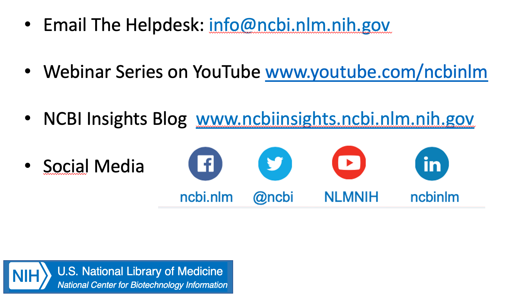

## NCBI DATASETS Workshop at CSHL 2021

**November 2, 2021, 9 a.m to 12 p.m.**

### Accessing NCBI sequence data using NCBI Datasets

In this workshop, you will learn about the NCBI Datasets resource and get hands-on experience using the datasets command-line tools (datasets and dataformat) to access, filter and download NCBI sequence and metadata for genomes, genes and orthologs.  

[NCBI Datasets ](https://www.ncbi.nlm.nih.gov/datasets/)

### What tasks will we learn today?

**Part I:** Accessing genomes

**Part II:** Accessing genes 

**Part III:** Accessing orthologs

**Part IV:** Building a BLAST database and creating a phylogenetic tree (optional)

**Part V:** Downloading large datasets

### How will we carry out these tasks? 

We will be using Jupyter Notebooks to demonstrate how to access data. No prior command-line or Jupyter Notebook experience is required. By the end of this seminar you will know how to use the datasets command line tools to access datasets for genes/genomes and orthologs based on parameters that interest you. 

We will also provide demonstrations and examples to help you better understand how to build your own searches and find the data you want. 

### Instructors

Nuala O'leary

### Co-instructors and breakout rooms:

| **Co-Instructor**| **Room Name** | 
| :-------------   | :------------ |    
| Mirian Tsuchiya  | Coatis        |
| Eric Cox         | Bees          |
| Brad Holmes      | Hummingbirds  |
| Peter	Meric      | Butterflies   |
| Ray Anderson III | Shrimp        |
| Vamsi	Kodali     | Sunflowers    |
| Adelaide Rhodes  | Penguins      |

### Technical Support

Adelaide Rhodes

Use the Zoom chat or join Adelaide in the Penguins breakout room for technical support

### Communication during the workshop

We will use etherpad to ask questions about the workshop tasks  
[Etherpad ](https://etherpad.wikimedia.org/p/CSHL_Datasets_Workshop_2021)

### Agenda

[Introductory Slides ](https://github.com/ncbi/datasets/blob/workshop-cshl-2021/training/cshl-2021/CSHL_workshop_intro.pdf)

How to Log In

Hands-On Activity/Demo in Jupyter Notebooks

Practice Exercises in Breakout Rooms

General Discussion and Wrap-Up

### Login Instructions for Jupyter Notebooks

**What is the IP for our Server?**

[https://jupyterhub01.ncbi.nlm.nih.gov/](https://jupyterhub01.ncbi.nlm.nih.gov/)

**Username**

The portion of your email address used to sign up for the workshop before the "@" symbol.

**Password**

Set your own password when you log in. Please write this down somewhere because we will not see it.

**Server Availability**

We will leave the server running for the rest of the day if you want to revisit the notebooks.

The notebook and all supporting materials can be found at this link.

[Github Link](https://github.com/ncbi/datasets/tree/workshop-cshl-2021/training/cshl-2021/)

### Additional Resources From the Workshop

[JQ Quickstart](https://www.ncbi.nlm.nih.gov/datasets/docs/v1/reference-docs/jq-cheatsheet/)

[JQ Cheat Sheet](https://github.com/ncbi/datasets/blob/workshop-cshl-2021/training/cshl-2021/jq_cheatsheet.md)

[A Beginner's  Tutorial to Jupyter Notebooks by George Seif](https://towardsdatascience.com/a-beginners-tutorial-to-jupyter-notebooks-1b2f8705888a)

### Websites

•	[Datasets](https://www.ncbi.nlm.nih.gov/datasets/)  

• [Install the Datasets command-line tools](https://www.ncbi.nlm.nih.gov/datasets/docs/v1/quickstarts/command-line-tools/)

### Look at Datasets examples for Jupyter notebooks on Binder

•	Browse and download [genomes](https://mybinder.org/v2/gh/ncbi/datasets/master?filepath=examples/jupyter/ncbi-datasets-pylib/ncbi-datasets-assembly.ipynb)

•	Browse and download [genes](https://mybinder.org/v2/gh/ncbi/datasets/master?filepath=examples/jupyter/ncbi-datasets-pylib/ncbi-datasets-gene.ipynb)

•	Analyze [gff3 files](https://mybinder.org/v2/gh/ncbi/datasets/master?filepath=examples/jupyter/ncbi-datasets-pylib/ncbi-datasets-gff3.ipynb)

•	Browse and download [SARS-CoV-2 assemblies](https://mybinder.org/v2/gh/ncbi/datasets/master?filepath=examples/jupyter/ncbi-datasets-pylib/ncbi-datasets-virus.ipynb)

